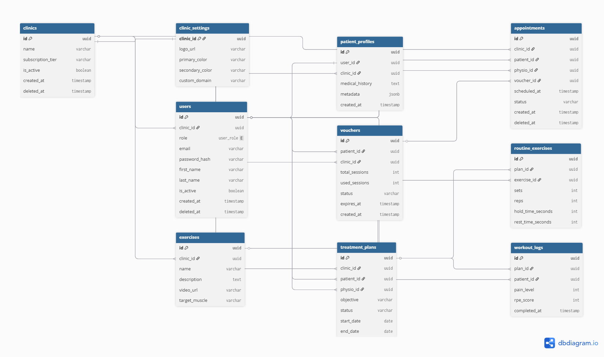

# 🏥 RehabGuard API | Secure B2B SaaS Rehabilitation Platform


Una API RESTful robusta, segura y escalable, diseñada como el motor (Backend) de una plataforma **SaaS Multi-Tenant** para la gestión de clínicas de fisioterapia, historiales clínicos y pautas de tele-rehabilitación.

Este proyecto nace de la intersección entre **10+ años de experiencia profesional en ciencias de la salud y el deporte**, y el desarrollo de software moderno. Su objetivo es traducir la lógica clínica real en una arquitectura de software limpia y orientada a la seguridad del paciente (HealthTech).

---

## 🏗️ Arquitectura y Diseño de Sistemas (System Design)

El sistema ha sido diseñado desde cero pensando en la escalabilidad comercial y el cumplimiento de normativas de protección de datos médicos (GDPR/LOPD):

- 🏢 **Arquitectura Multi-Tenant:** Aislamiento de datos a nivel de base de datos (`clinic_id`). Permite que múltiples clínicas utilicen el SaaS simultáneamente sin riesgo de fuga de datos entre inquilinos.
- 🎨 **White-Labeling (Marca Blanca):** Relaciones 1:1 en la base de datos para inyectar dinámicamente configuraciones de interfaz (logos, colores corporativos) según la clínica que acceda.
- 🛡️ **Seguridad por Diseño (Security by Design):** \* Uso de **UUIDs** como claves primarias para prevenir ataques de enumeración (IDOR).
  - Implementación de **Soft Deletes** (`deleted_at`) en todas las tablas críticas para cumplir con las políticas de retención de datos médicos sin romper la integridad referencial.
- 🎛️ **Control de Acceso (RBAC):** Sistema de roles granulares (SuperAdmin, Clinic Admin, Physio, Receptionist, Patient) gestionado mediante tokens JWT para proteger endpoints sensibles.
- ⚡ **Lógica Event-Driven (Prevención de Riesgos):** El sistema bloquea automáticamente las rutinas de ejercicios y alerta al profesional si un paciente registra un nivel de dolor severo (Escala EVA) en sus logs de entrenamiento.

---

## 📊 Esquema de Base de Datos (ERD)

A continuación, se detalla el modelo de datos relacional que soporta la lógica de negocio, incluyendo la gestión de bonos transaccionales y la dosificación de ejercicios (N:M).



---

## ✨ Características Principales de la API

- 🏛️ **Arquitectura de 3 Capas:** Separación clara entre modelos de datos (SQLAlchemy), esquemas de validación (Pydantic) y lógica de rutas (Routers).
- 🔐 **Seguridad Integrada:** Gestión de credenciales mediante variables de entorno (`.env`) y encriptación de contraseñas.
- 🎟️ **Integridad Transaccional:** Control de concurrencia y transacciones ACID en la reserva de citas y el cobro de sesiones mediante bonos (`Vouchers`).
- 📖 **Documentación Automática:** Generación de Swagger UI y ReDoc nativo para facilitar la integración con equipos de Frontend.

---

## 🛠️ Stack Tecnológico

- **Lenguaje:** Python 3.12+
- **Framework:** FastAPI
- **Servidor:** Uvicorn
- **Base de Datos:** MySQL 8.0+
- **ORM:** SQLAlchemy
- **Validación:** Pydantic
- **Seguridad:** Passlib (Bcrypt) + Cryptography + JWT (JSON Web Tokens)

---

## 💻 Instalación y Uso Local

1.  **Clona el repositorio:**

    ```bash
    git clone [https://github.com/davidvalades/rehab-api-core.git](https://github.com/davidvalades/rehab-api-core.git)
    cd rehab-api-core
    ```

2.  **Crea y activa el entorno virtual:**

    ```bash
    python3 -m venv venv
    source venv/bin/activate  # En Windows usa: venv\Scripts\activate
    ```

3.  **Instala las dependencias:**

    ```bash
    pip install -r requirements.txt
    ```

4.  **Configuración de Variables de Entorno:**
    Crea un archivo `.env` en la raíz del proyecto basándote en el archivo de ejemplo:

    ```env
    DB_USER=tu_usuario
    DB_PASSWORD=tu_contraseña
    DB_HOST=localhost
    DB_PORT=3306
    DB_NAME=rehab_db
    SECRET_KEY=tu_clave_secreta_jwt
    ```

5.  **Ejecuta el servidor:**
    ```bash
    uvicorn main:app --reload
    ```
    _La documentación interactiva estará disponible en `http://localhost:8000/docs`_

---

## 📁 Estructura del Proyecto

```text
rehab-api-core/
├── assets/          # Imágenes y diagramas para documentación
├── core/            # Configuraciones globales y seguridad (JWT, dependencias)
├── db/              # Conexión a Base de Datos y sesión
├── models/          # Modelos de tablas (SQLAlchemy ORM)
├── schemas/         # Esquemas de validación y serialización (Pydantic)
├── routers/         # Endpoints agrupados por dominio (users, appointments...)
├── services/        # Lógica de negocio pura (separada de las rutas)
├── main.py          # Punto de entrada de la aplicación FastAPI
└── .env             # Variables de entorno (ignorado en Git)
```

---

_⭐ Desarrollado por: [David Valadés Navarro](https://github.com/davidValades) - Backend-focused Developer | Cybersecurity Learner_

---
